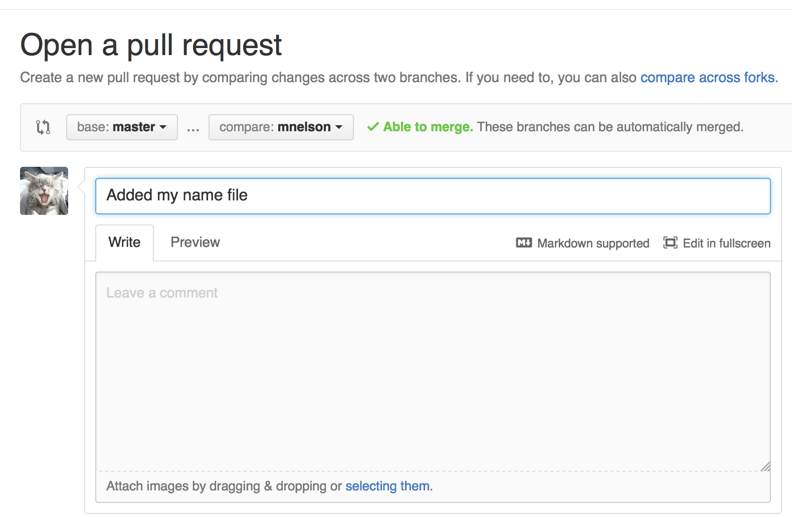
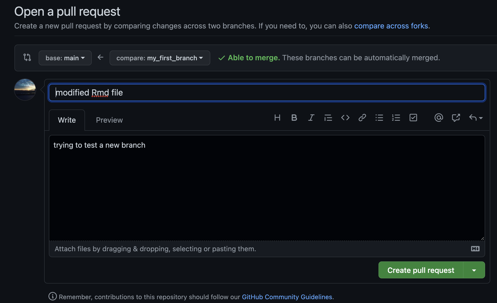
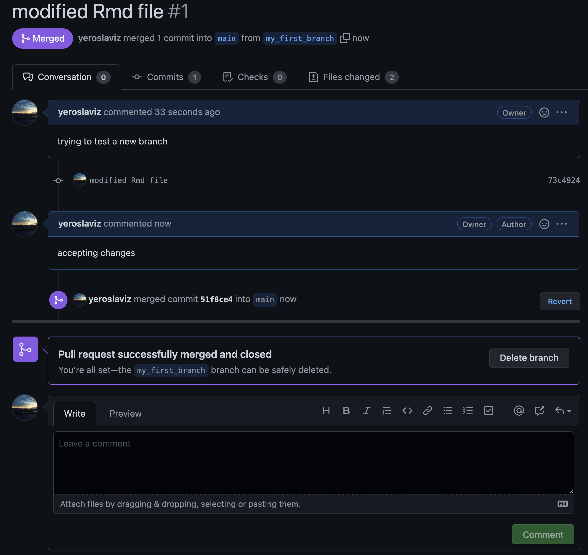

```{r setup, include=FALSE}
knitr::opts_chunk$set(echo = TRUE)
```

## Step 0: Install git and create a GitHub account 

Of course without installing git on your computer and having a git account you cannot use git. so first do this.

- [installing git](https://git-scm.com/book/en/v2/Getting-Started-Installing-Git)
- [Github account](https://github.com/join)

## Step 1: Create a local git repository 

```shell
$ cd ownCloud/ownCloud_Personal/ownCloud_projects/AG_Cox/github/
$ mkdir myGit
$ cd myGit/
```

To initialize the git repository, one can use the command line as such

```shell
$ git init
```

In my case I will use RStudio, which can create a porject already with versioning control using `git`. It takes an already existing Github repository and uses it, so it doesn't need to be initialized. 

## Step 2: Add a new file to the repo

Here we can add any file we need. Again as I havr already created it via an exiting Github repository, I ahave already a few files in it.

```shell
$ ls
HOWTO_git.Rmd  HOWTO_git.html LICENSE        README.md      myGit.Rproj
```

Using `git status` one can see the status of my git repository and which files in my local folder are known to the repositoy online.

```shell
$ git status
On branch main
Your branch is up to date with 'origin/main'.

Untracked files:
  (use "git add <file>..." to include in what will be committed)
        HOWTO_git.Rmd
        HOWTO_git.html
        myGit.Rproj

nothing added to commit but untracked files present (use "git add" to track)
```

A `commit` is a record of what changes you have made since the last time you made a commit. Essentially, you make changes to your repo (for example, adding a file or modifying one) and then tell `git` to put those changes into a `commit`.

How do you tell `git` which files to put into a `commit`? This is where the `staging environment` comes in. As seen above, when you make changes to your repo, `git` notices that a file has changed but won't do anything with it.

To add a file to a `commit`, you first need to add it to the staging environment. To do this, you can use the `git add <filename> command`.

## Step 3: Add a file to the staging environment

This is done using the `git add` command. Again T RStudio takes care of that for you, when one just put the ticks in the Git tab on the left (where is says `Staged` - this is adding to the staging environment).

```shell 
$ git add HOWTO_git.*

$ git status
On branch main
Your branch is up to date with 'origin/main'.

Changes to be committed:
  (use "git restore --staged <file>..." to unstage)
        new file:   HOWTO_git.Rmd
        new file:   HOWTO_git.html

Untracked files:
  (use "git add <file>..." to include in what will be committed)
        myGit.Rproj
```

Now, after we added the two files, they are ready to be committed. 

## Step 4: Create a commit

By committing the files to the repository they will be added also on the Github website

```shell
$ git commit -m "Adding html files"
[main aca3ae5] Adding html files
 2 files changed, 297 insertions(+)
 create mode 100644 HOWTO_git.Rmd
 create mode 100644 HOWTO_git.html
```

## Step 5: Create a new branch

Ifyou want to make a new feature but are worried about making changes to the main project while developing the feature. This is where git branches come in. 

Branches allow you to move back and forth between 'states' of a project. Official git docs describe branches this way: 

    A branch in Git is simply a lightweight movable pointer to one of these commits.

For instance, if you want to add a new page to your website you can create a new branch just for that page without affecting the main part of the project. Once you're done with the page, you can merge your changes from your branch into the primary branch. When you create a new branch, Git keeps track of which commit your branch 'branched' off of, so it knows the history behind all the files. 

Let's say you are on the primary branch and want to create a new branch to develop your web page. Here's what you'll do: Run `git checkout -b <my branch name>`. This command will automatically create a new branch and then 'check you out' on it, meaning git will move you to that branch, off of the primary branch.

Using this command one can create a new branch and switch to it on-the-fly. 
```shell 
$ git checkout -b my_first_branch
Switched to a new branch 'my_first_branch'
```
```shell
$ git branch
  main
* my_first_branch
```

The `*` symbols shows the active branch.

Switching back to the `main` branch can be done using `switch`

```shell
$ git switch main
M       HOWTO_git.Rmd
M       HOWTO_git.html
Switched to branch 'main'
Your branch is up to date with 'origin/main'.
```

## Step 7: Push a branch to GitHub

Now we'll push the commit in your branch to your new GitHub repo. This allows other people to see the changes you've made. If they're approved by the repository's owner, the changes can then be merged into the primary branch.

First I switch back to the new branch

```shell
$ git switch my_first_branch
M       HOWTO_git.Rmd
M       HOWTO_git.html
Switched to branch 'my_first_branch'
```

Then I add and commit the new changes in this branch

```shell
$ git add HOWTO_git.*

$ git commit -m "modified Rmd file"
[my_first_branch 73c4924] modified Rmd file
 2 files changed, 101 insertions(+), 1 deletion(-)
```

Now I can push the new changes onto the repository. 

```shell 
$ git remote add myGit  https://github.com/yeroslaviz/myGit.git

$ git push myGit my_first_branch
Enumerating objects: 7, done.
Counting objects: 100% (7/7), done.
Delta compression using up to 8 threads
Compressing objects: 100% (4/4), done.
Writing objects: 100% (4/4), 2.90 KiB | 330.00 KiB/s, done.
Total 4 (delta 3), reused 0 (delta 0), pack-reused 0
remote: Resolving deltas: 100% (3/3), completed with 3 local objects.
remote: 
remote: Create a pull request for 'my_first_branch' on GitHub by visiting:
remote:      https://github.com/yeroslaviz/myGit/pull/new/my_first_branch
remote: 
To https://github.com/yeroslaviz/myGit.git
 * [new branch]      my_first_branch -> my_first_branch
```

The creation of the first branch is automatically shown on my web site

```{r  echo=FALSE, fig.cap="pushing the first branch", fig.align="center", fig.pos="!ht"}
filename <- file.path("Images/my_first_branch.png")
if(exists("filename")){
  knitr::include_graphics(filename)
}
```

## Step 8: Create a pull request (PR)

A pull request (or PR) is a way to alert a repo's owners that you want to make some changes to their code. It allows them to review the code and make sure it looks good before putting your changes on the primary branch.


```{r, echo=FALSE, fig.show = "hold", out.width = "50%", fig.align = "default", out.height= 250, fig.cap= "Creating a Pull Request (PR)"}
 

 
```

## Step 9: Merge a PR

```{r, echo=FALSE, fig.show = "hold", out.width = "50%", fig.align = "default", fig.cap= "Merging accepted"}
 
```

After merging it is a good idea to delete the branch to prevent future chaos with too many branches. 

## Step 10: Get changes on GitHub back to your computer

The Github repo is different than the one on the computer. locally I still have two brachens, online the newer one was deleted. 

In order to get the most recent version to the locl machine, one needs to use the `git pull` command. 

```shell
git pull origin main
```


An now everything is up-to-date both on the local machine as well as in my Github repo.

```shell
$ git status
On branch main
Your branch is up to date with 'origin/main'.

nothing to commit, working tree clean
```

## Step 11: changing some `--config` prameters

Checking the set parameters can be done with 

```shell 
git config --global --list
```

Here I can see my user name, the email address Im using to connect my Github repoitory as well as the default editor used for `git`.

A good resource for the [git setting](https://swcarpentry.github.io/git-novice/02-setup/). 


